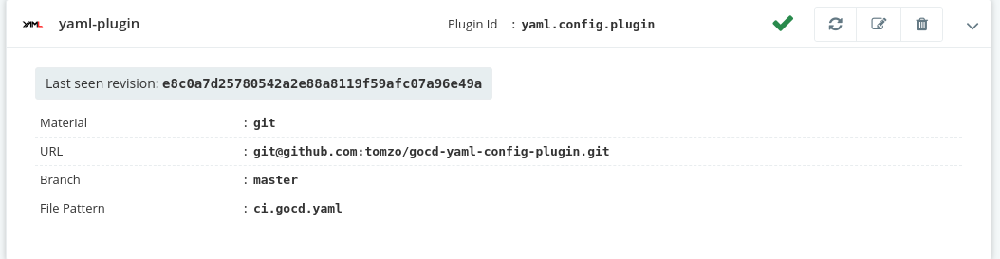
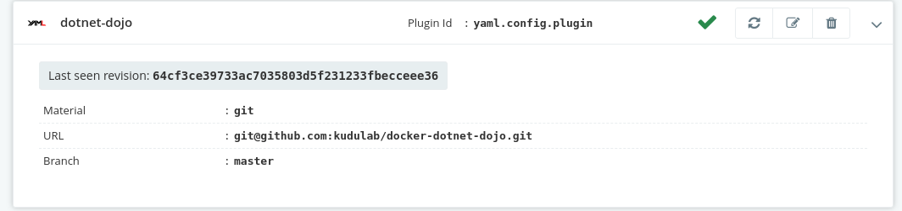

[](https://gitter.im/gocd/configrepo-plugins?utm_source=badge&utm_medium=badge&utm_campaign=pr-badge&utm_content=badge)

# gocd-yaml-config-plugin

[](https://travis-ci.com/tomzo/gocd-yaml-config-plugin)

[GoCD](https://www.gocd.org) plugin to keep **pipelines** and **environments**
configuration in source-control in [YAML](http://www.yaml.org/).
See [this document](https://docs.gocd.org/current/advanced_usage/pipelines_as_code.html)
to find out what are GoCD configuration repositories.

This is the second GoCD configuration plugin, which enhances some of shortcomings of
[JSON configuration plugin](https://github.com/tomzo/gocd-json-config-plugin)

* Format is **concise**. Unlike JSON, there are no unnecessary quotations `"`, brackets `{}` and commas `,`
* Tries to **enforce correctness** where possible. By using maps instead of lists and shorter object graphs.
* Allows to have multiple pipelines and environments in single file. But doesn't force it.
* **Comments in configuration files** - YAML supports comments,
so you can explain why pipeline/environment it is configured like this.

# Table of contents

1. [Setup](#setup)
1. [Example configuration](#example)
1. [File pattern](#file-pattern)
1. [Validation](#Validation)
1. **[Format reference](#Format-reference)**
1. [Format version](#Format-version)
1. [Issues and questions](#Issues-and-questions)
1. [Development](#Development)
1. [License](#License)

# Setup

**Step 1**: GoCD versions newer than `17.8.0` already have the plugin bundled. You don't need to install anything.

If you're using GoCD version *older than 17.8.0*, you need to install the plugin in the GoCD server. Download it from
[the releases page](https://github.com/tomzo/gocd-yaml-config-plugin/releases) and place it on the GoCD server in
`plugins/external` [directory](https://docs.gocd.org/current/extension_points/plugin_user_guide.html).


**Step 2**: Follow [the GoCD documentation](https://docs.gocd.org/current/advanced_usage/pipelines_as_code.html#storing-pipeline-configuration-in-json) to add a new configuration repository.

You can use the example repository at: `https://github.com/tomzo/gocd-yaml-config-example.git`.

In your config repo (`tomzo/gocd-yaml-config-example.git` in this case), ensure that your GoCD yaml config is suffixed with `.gocd.yaml`. Any file ending in `.gocd.yaml` is picked up by the plugin. Give it a minute or so for the polling to happen. Once that happens, you should see your pipeline(s) on your dashboard.

## Example

More examples are in [test resources](src/test/resources/examples/).

```yaml
#ci.gocd.yaml
format_version: 9
environments:
  testing:
    environment_variables:
      DEPLOYMENT: testing
    secure_variables:
      ENV_PASSWORD: "s&Du#@$xsSa"
    pipelines:
      - example-deploy-testing
      - build-testing
pipelines:
  mypipe1: # definition of mypipe1 pipeline
    group: mygroup # note that the group name can contain only of alphanumeric & underscore characters
    display_order: 10
    label_template: "${mygit[:8]}"
    lock_behavior: none
    parameters: # list of parameters that can be configured for a pipeline
      param1: value1
    materials:
      mygit: # this is the name of material, the name can contain only of alphanumeric & underscore characters
        # keyword git says about type of material and url at once
        git: http://my.example.org/mygit.git
        branch: ci
      myupstream: # this name does not matter, but there should be no 2 materials with the same name
        # type is optional here, material type is implied based on presence of pipeline and stage fields
        # type: dependency
        pipeline: pipe2
        stage: test
    stages: # list of stages in order
      - build: # name of stage
          clean_workspace: true
          jobs:
            csharp: # name of the job
              resources:
               - net45
              artifacts:
               - build:
                   source: bin/
                   destination: build
               - test:
                   source: tests/
                   destination: test-reports/
               - test:
                   source: coverage.xml
              tabs:
                report: test-reports/index.html
              tasks: # ordered list of tasks to execute in job csharp
               - fetch:
                   pipeline: pipe2
                   stage: build
                   job: test
                   source: test-bin/
                   destination: bin/
               - exec: # indicates type of task
                   command: make
                   arguments:
                    - "VERBOSE=true"
               # shorthand for script-executor plugin
               - script: ./build.sh ci
```

## File pattern

The default pattern is `**/*.gocd.yaml,**/*.gocd.yml`, which will recursively search the entire repository for all files ending with `.gocd.yaml` or `.gocd.yml`.

You can set a custom file pattern per configuration repository using the GoCD configuration UI:


Or in the config XML using `<configuration>`:

```xml
<config-repos>
  <config-repo pluginId="yaml.config.plugin" id="repo1">
    <git url="https://github.com/tomzo/gocd-yaml-config-example.git" />
    <configuration>
      <property>
        <key>file_pattern</key>
        <!-- comma-separate multiple patterns -->
        <value>pipelines/build/*.yml,pipelines/lint/*.yml</value>
      </property>
    </configuration>
  </config-repo>
</config-repos>
```

# Validation

You can validate if proposed GoCD YAML changes will be accepted by the server. Currently, 2 options are available:
 * Use a [GoCD mergable github action](https://github.com/GaneshSPatil/gocd-mergeable)
 * [Validate from your local machine](#validation-using-cli)

## Validation using CLI

*You may find this [introductory blog post useful](https://kudulab.io/posts/gocd-preflight-validation/).*

There is an ongoing effort to allow in-depth validation of configuration **before pushing configuration to the source control**. This is provided by [GoCD's preflight API](https://api.gocd.org/current/#preflight-check-of-config-repo-configurations) and [gocd-cli](https://github.com/gocd-contrib/gocd-cli).

You have several options to configure validation tools on your workstation:
 * If you have a local docker daemon, use the [gocd-cli-dojo](https://github.com/gocd-contrib/docker-gocd-cli-dojo) image. Follow the [setup instructions](https://github.com/gocd-contrib/docker-gocd-cli-dojo#setup) in the image readme.
 * If you don't want to use docker, you'll need to [setup `gocd-cli` on your host](https://github.com/gocd-contrib/gocd-cli).

Either way you'll have `gocd` binary in your `PATH` or inside the docker container.

### Syntax validation

This will check general validity of the yaml file, without talking to the GoCD server:
```bash
gocd configrepo syntax --yaml pipeline.gocd.yaml
```

### Preflight validation

This command will parse and submit your yaml file to the configured GoCD server.
```
gocd configrepo preflight --yaml -r dotnet-dojo pipeline.gocd.yaml
```
Where `-r` is the configuration repository id, which you have earlier configured on GoCD server. You can check it on config repos page of your GoCD server, at `/go/admin/config_repos`. It is in the upper left corner of each config repo.


For new repositories, when you haven't added config repo to the server yet, you can also check if it is correct, just skip the `-r` argument.
```
gocd configrepo preflight --yaml pipeline.gocd.yaml
```

# Format reference

See [official GoCD XML configuration reference](https://docs.gocd.org/current/configuration/configuration_reference.html)
for details about each element. Below is a reference of format supported by this plugin.
Feel free to improve it!

1. [**Format version**](#format-version)
1. [Environment](#environment)
1. [Environment variables](#environment-variables)
1. [Parameters](#parameters)
1. [Pipeline](#pipeline)
    * [Tabs](#tabs)
    * [Controlling the display order](#display-order-of-pipelines)
    * [Tracking tool](#tracking-tool)
    * [Timer](#timer)
    * [Locking](#pipeline-locking)
1. [Stage](#stage)
    * [Approval](#approval)
1. [Job](#job)
    * [Property](#property)
    * [Tab](#tab)
    * [Many instances](#run-many-instances)
1. [Tasks](#tasks)
    * [rake](#rake)
    * [ant](#ant)
    * [nant](#nant)
    * [exec](#exec)
    * [fetch](#fetch)
    * [pluggabletask](#plugin)
    * [script](#script)
1. [Materials](#materials)
    * [dependency](#dependency)
    * [package](#package)
    * [git](#git)
    * [svn](#svn)
    * [perforce](#perforce)
    * [tfs](#tfs)
    * [hg](#hg)
    * [pluggable scm](#pluggable)
    * [config repo](#configrepo)
1. [Secure variables](#to-generate-an-encrypted-value)
1. [YAML Aliases](#yaml-aliases)

## Format version

Please note that it is now recommended to declare `format_version` in each `gocd.yaml` file, consistent across all your files.

#### GoCD server version from 20.8.0 and beyond

Supports `format_version` value of `10`. This version removes usage of `blacklist/whitelist` keywords in favour of `includes/ignore`. This is done in a backwards compatible way - you can upgrade the server and plugin first, and update the format_version to 10 after. Just replace `whitelist` by `includes`, and `blacklist` by `ignore`.

Additionally, plugin is also "forwards compatible" since version 0.13.0. If you can't upgrade GoCD to 20.8.0, but want to migrate from `blacklist/whitelist` to `includes/ignore`, you can upgrade the plugin and keep the format_version that you are using. Plugin will migrate keywords under the hood, while your YAML can use `includes/ignore`.

Using a newer `format_version` includes all the behavior of the previous versions too.

```yaml
format_version: 10
pipelines:
  ...
environments:
```

#### GoCD server version from 19.10.0 and beyond

Supports `format_version` value of `9`. In this version, support of `ignore_for_scheduling` for [dependency materials](#dependency) has been added. Setting this attribute will skip scheduling the pipeline when the dependency material has changed.

Using a newer `format_version` includes all the behavior of the previous versions too.

#### GoCD server version from 19.9.0 and beyond

Supports `format_version` value of `7` and `8`. In version `7`, support for [properties](#property) has been removed. In version `8`, support for `mingle` as a [tracking tool](#tracking-tool) has been removed.

Using a newer `format_version` includes all the behavior of the previous versions too.


#### GoCD server version from 19.8.0 and beyond

Supports `format_version` value of `6`. In this version, support of `allow_only_on_success` attribute for [approval](#approval) in stage has been added. Setting this attribute to `true` will allow the stage to be manually triggered only if the previous stage has passed successfully.

Using a newer `format_version` includes all the behavior of the previous versions too.

#### GoCD server version from 19.4.0 to 19.7.0

Supports `format_version` value of `5`. In this version, support of `username` and `encrypted_password` for [git](#git-material-update) and [hg](#hg-material-update) material has been added. In addition to that, [hg](#hg-material-update) will also support `branch` attribute.

Using a newer `format_version` includes all the behavior of the previous versions too.


#### GoCD server version 19.3.0

Supports `format_version` value of `4`. In this version, support has been added to control the [display order of pipelines](#display-order-of-pipelines).

This server version also supports `format_version` of `3` and `2`. Using a newer `format_version` includes all the behavior of the previous versions too.

#### GoCD server version from 18.7.0 to 19.2.0

Supports `format_version` value of `3`. In this version [fetch artifact](#fetch) format was changed to include `artifact_origin`.

This server version also supports `format_version` of `2`. Using a newer `format_version` includes all the behavior of the previous versions too.

#### GoCD server version from 17.12.0 to 18.6.0

Supports `format_version` value of `2`. In this version [pipeline locking](#pipeline-locking) behavior was changed.

#### GoCD server version up to 17.11.0

Supports `format_version` value of `1`. This is the initial version.

# Pipeline

A minimal [pipeline](https://docs.gocd.org/current/configuration/configuration_reference.html#pipeline) configuration must contain:
 * pipeline name - as a key in hash
 * [materials](#materials) - a **hash**
 * [stages](#stage) - a **list** or a `template` - as a key in hash

```yaml
mypipe:
  group: mygroup
  materials:
    mygit:
      git: http://example.com/mygit.git
  stages:
    - build:
        jobs:
          build:
            tasks:
             - exec:
                 command: make
```

All elements available on a pipeline object are:

 * `group`
 * `label_template`
 * [locking](#pipeline-locking)
 * [tracking_tool](#tracking-tool) or `mingle`
 * [timer](#timer)
 * [environment_variables](#environment-variables)
 * [parameters](#parameters)
 * `secure_variables`
 * [materials](#materials)
 * [stages](#stage)
 * `template`

```yaml
pipe2:
  group: group1
  label_template: "foo-1.0-${COUNT}"
  lock_behavior: none
  tracking_tool:
    link: "http://your-trackingtool/yourproject/${ID}"
    regex: "evo-(\\d+)"
  timer:
    spec: "0 15 10 * * ? *"
  environment_variables:
    DEPLOYMENT: testing
  secure_variables:
    ENV_PASSWORD: "s&Du#@$xsSa"
  materials:
    ...
  stages:
    ...
```
#### Referencing an existing template in a pipeline:
```yaml
mypipe:
  group: group1
  label_template: "foo-1.0-${COUNT}"
  lock_behavior: none
  parameters:
    param1: value
  materials:
    mygit:
      git: http://example.com/mygit.git
  template: template1
```

Please note:
 * Pipeline declares a group to which it belongs

<a name="display-order-of-pipelines"/>

### Controlling the display order

When `format_version` is `4` (see [above](#format-version)), the order of display of pipelines on the GoCD dashboard can be influenced by setting the `display_order` property.

- This is an integer property and the pipelines in a pipeline group will be ordered by this value.
- The default value for this property is `-1`.
- Pipelines defined in GoCD's config XML will also default to -1.
- If multiple pipelines have the same `display_order` value, their order relative to each other will be indeterminate.

```json
mypipeline1:
  group: group1
  display_order: 10

mypipeline2:
  group: group1
  display_order: -10
```

In the above example, since both pipelines are in the same group, `pipeline2` will be shown ahead of `pipeline1`. If any pipelines are defined in the GoCD config XML, then they will appear in between these two pipelines.

### Tracking tool

```yaml
tracking_tool:
  link: "http://your-trackingtool/yourproject/${ID}"
  regex: "evo-(\\d+)"
```

### Timer

```yaml
timer:
  spec: "0 15 10 * * ? *"
  only_on_changes: yes
```

See [Quartz](https://www.quartz-scheduler.org/documentation/quartz-2.3.0/tutorials/crontrigger.html) about writing cron-like schedules.

### Pipeline locking

For **GoCD >= 17.12 and `format_version: 2` and above**:

```yaml
lock_behavior: none
```

Where `lock_behavior` is defined as in [GoCD documentation](https://docs.gocd.org/17.12.0/configuration/admin_lock_pipelines.html) can be one of:

 * `lockOnFailure` - same as `locking: true`
 * `unlockWhenFinished`
 * `none` - same `locking: false`

For **GoCD < 17.12 and `format_version: 1`**:

`locking: on`

Where `locking` is a [boolean](#boolean-values).


## Stage

A minimal stage must contain `jobs:` element or `tasks:` in [single-job stage case](single-job-stage).
```yaml
build:
  jobs:
    firstJob:
      ...
    secondJob:
      ...
```

A custom stage:
```yaml
test:
  fetch_materials: yes
  keep_artifacts: yes
  clean_workspace: yes
  approval:
    type: manual
    roles:
      - manager
    users:
      - john
  environment_variables:
    TEST_NUM: 1
  secure_variables:
    PASSWORD: "!@ESsdD323#sdu"
  jobs:
    one:
      ...
    two:
      ...
```

 * When `keep_artifacts` is set to `true` GoCD will never delete artifacts in this stage. This is equivalent of XML's `artifactCleanupProhibited`. By default this is `false`.

### Approval

Stage can have [approval](https://docs.gocd.org/current/configuration/configuration_reference.html#approval),
 which is `success` by default. There are 2 ways to declare approval:
```yaml
approval: manual
```
If you need to set associated users or roles:
```yaml
approval:
  type: manual
  allow_only_on_success: true
  roles:
    - manager
  users:
    - john
```

You can set `allow_only_on_success` to allow manual trigger only if the previous stage run is successful. The default value is `false`.

## Job

[Job](https://docs.gocd.org/current/configuration/configuration_reference.html#job) is a hash starting with jobs name:

```yaml
test:
  timeout: 5
  run_instances: 7
  environment_variables:
    LD_LIBRARY_PATH: .
  tabs:
    test: results.xml
  resources:
    - linux
  artifacts:
    - test:
        source: src
        destination: dest
    - build:
        source: bin
    - external:
        id: docker-release-candidate
        store_id: dockerhub
        configuration:
          options:
            Image: gocd/gocd-demo
            Tag: v${GO_PIPELINE_LABEL}
          secure_options:
            some_secure_property: "!@ESsdD323#sdu"
  tasks:
    ...
```

*Note: timeout is added since 0.2.0 version of yaml plugin*

### Elastic agent profile id

Job configuration may define elastic agents profile id, as such:
```yaml
elastic_profile_id: "docker.unit-test"
```

It MUST NOT be specified along with `resources`.
Available in GoCD server since v16.12.0, yaml plugin 0.4.0.

### Artifacts

There are 3 types of artifacts recognized by GoCD. `Build` and `Test` artifacts are stored on the GoCD server.
The source and the destination of the artifact that should be stored on the GoCD server must be specified.

#### Build

```yaml
- build:
    source: bin
    destination: binaries
```

#### Test

```yaml
- test:
    source: reports
    destination: test-reports
```

#### External

Artifacts of type `external` are stored in an artifact store outside of GoCD.
The external artifact store's configuration must be created in the main GoCD config. Support for external artifact store config to be checked in as yaml is not available.
The external artifact store is referenced by the `store_id`. The build specific artifact details that the artifact plugin needs to publish the artifact is provided as `configuration`.

```yaml
- external:
    id: docker-release-candidate
    store_id: dockerhub
    configuration:
      options:
        Image: gocd/gocd-demo
        Tag: v${GO_PIPELINE_LABEL}
      secure_options:
        some_secure_property: "!@ESsdD323#sdu"
```

[S3 plugin 2.x](https://github.com/Diogomrol/gocd-s3-artifact-plugin) example usage:
```yaml
- external:
    id: pkg
    store_id: s3-eu-west-1
    configuration:
      options:
        Source: installers/target/
        Destination: ${GO_ARTIFACT_LOCATOR}
```

### Run many instances

Part of job object can be [number of job to runs](https://docs.gocd.org/current/advanced_usage/admin_spawn_multiple_jobs.html):
```yaml
run_instances: 7
```
Or to run on all agents:
```yaml
run_instances: all
```

### Tabs

Tabs are a hash with `<tab-name>: <path>` pairs.
Path should exist in GoCD servers artifacts.
```yaml
tabs:
  tests: test-reports/index.html
  gauge: functional-reports/index.html
```

### Property
**DEPRECATION NOTICE: Since GoCD version 19.9 and format_version 7, properties are no longer supported**

Job can have properties, declared as a hash:
```yaml
properties:
  cov1: # this is the name of property
    source: test.xml
    xpath: "substring-before(//report/data/all/coverage[starts-with(@type,\u0027class\u0027)]/@value, \u0027%\u0027)"
  performance.ind1.mbps:
    source: PerfTestReport.xml
    xpath: "//PerformanceSuiteReport/WriteOnly/MBps"
```

### Single job stage

A common use case is that stage has only one job. This plugin provides a shorthand
to declared such stages - just **omit the `jobs:` and job name** from configuration tree.
You can then declare job and stage options on the same (stage) level:
```yaml
stages:
  - build:
      approval: manual
      resources:
        - cpp
      tasks:
       - exec:
           command: make
```
Above configuration declares `build` **stage** with `build` **job** which executes `make` task.

## Materials

### Git

Minimal configuration of a [**git** pipeline material](https://docs.gocd.org/current/configuration/configuration_reference.html#git):
 * material name is `mygit`
 * git repository url is `http://example.com/mygit.git`

```yaml
mygit:
  git: http://example.com/mygit.git
```

Above can be also written more explicitly:
```yaml
mygit:
  type: git
  url: http://example.com/mygit.git
```

More customized git material is possible:
```yaml
gitMaterial1:
  git: "http://my.git.repository.com"
  branch: feature12
  ignore:
    - externals/**/*.*
    - tools/**/*.*
# For GoCD < 20.8.0 or plugin version < 0.13.0, you need to use blacklist instead of ignore:
  blacklist:
    - externals/**/*.*
    - tools/**/*.*
  destination: dir1
  auto_update: false
  shallow_clone: true
```

Since GoCD `>= 16.7.0` includes is also supported,
you can specify `includes` **instead** of `ignore`, as such
```yaml
gitMaterial1:
  git: "git@my.git.repository.com"
  branch: "feature12"
  includes:
    - src/**/*.*
# For GoCD < 20.8.0 or plugin version < 0.13.0, you need to use whitelist instead:
  whitelist:
    - src/**/*.*
```

<a name="git-material-update"/>

For **GoCD >= 19.4.0 and `format_version: 5` and above**:

You are advised to utilize `username` and `encrypted_password` for passing in material credentials as:
```yaml
gitMaterial1:
  git: "http://my.git.repository.com"
  branch: feature12
  username: my_username
  encrypted_password: encrypted_value
```

- Instead of `encrypted_password` you may specify `password` but `encrypted_password` makes more sense considering that the value is stored in SCM.
- Specifying credentials both in `attributes` and `url` will result in a validation error e.g.
  ```log
    INVALID MERGED CONFIGURATION
    Number of errors: 1+
    1. Ambiguous credentials, must be provided either in URL or as attributes.;;
    - For Config Repo: https://your.config.repo.url at cbb047d78c239ab23b9565099e800c6fe4cc0anc
  ```

### Svn

For details about each option, see [GoCD XML reference](https://docs.gocd.org/current/configuration/configuration_reference.html#svn)
```yaml
svnMaterial1:
  svn: "http://svn"
  username: "user1"
  encrypted_password: "encrypted_value"
  check_externals: true
  ignore:
    - tools
    - lib
# For GoCD < 20.8.0 or plugin version < 0.13.0, you need to use blacklist instead of ignore:
  blacklist:
    - tools
    - lib
  destination: destDir1
  auto_update: false
```
Instead of `encrypted_password` you can specify `password`.

### Hg

```yaml
hgMaterial1:
  hg: repos/myhg
  ignore:
    - externals
    - tools
# For GoCD < 20.8.0 or plugin version < 0.13.0, you need to use blacklist instead of ignore:
  blacklist:
    - externals
    - tools
  destination: dir1
  auto_update: false
  username: my_username
  encrypted_password: encrypted_value
  branch: feature
```
<a name="hg-material-update"/>

For **GoCD >= 19.4.0 and `format_version: 5` and above**:

You are advised to utilize `username` and `encrypted_password` for passing in material credentials as:
```yaml
hgMaterial1:
  hg: repos/myhg
  username: my_username
  encrypted_password: encrypted_value
```

- Instead of `encrypted_password` you may specify `password` but `encrypted_password` makes more sense considering that the value is stored in SCM.
- Specifying credentials both in `attributes` and `url` will result in a validation error e.g.
  ```log
    INVALID MERGED CONFIGURATION
    Number of errors: 1+
    1. Ambiguous credentials, must be provided either in URL or as attributes.;;
    - For Config Repo: https://your.config.repo.url at cbb047d78c239ab23b9565099e800c6fe4cc0anc
  ```

In addition to that, you can also leverage `branch` attribute to specify the branch for material

```yaml
hgMaterial1:
  hg: repos/myhg
  branch: feature
```


### Perforce

```yaml
p4Material1:
  p4: "host.domain.com:12345"
  username: johndoe
  encrypted_password: encrypted_value
  use_tickets: false
  view: |
    //depot/external... //ws/external...
    //depot/tools... //ws/external...
  ignore:
    - externals
    - tools
# For GoCD < 20.8.0 or plugin version < 0.13.0, you need to use blacklist instead of ignore:
  blacklist:
    - externals
    - tools
  auto_update: false
```

Instead of `encrypted_password` you can specify `password`.

### Tfs

*TODO: - not supported by yaml plugin yet*

### Pluggable

```yaml
myPluggableGit:
  scm: someScmGitRepositoryId
  destination: destinationDir
  ignore:
    - dir1
    - dir2
# For GoCD < 20.8.0 or plugin version < 0.13.0, you need to use blacklist instead of ignore:
  blacklist:
    - dir1
    - dir2
```

Since GoCD `>= 19.2.0` defining new pluggable materials that are not defined
in the GoCD server is supported.

```yaml
myPluggableGit:
  plugin_configuration:
    id: plugin_Id
    version: 1 #plugin version
  options:
    url: git@github.com:tomzo/gocd-yaml-config-plugin.git
  secure_options:
    password: "encrypted_value"
  destination: destinationDir
  ignore:
    - dir1
    - dir2
# For GoCD < 20.8.0 or plugin version < 0.13.0, you need to use blacklist instead of ignore:
  blacklist:
    - dir1
    - dir2
```

### Configrepo

This is a convenience for shorter and more consistent material declaration.
When configuration repository is the same as one of pipeline materials,
then you usually need to repeat definitions in XML and in JSON, for example:

```yaml
materials:
  foo:
    git: "https://github.com/tomzo/gocd-json-config-example.git",
    branch: ci
```

And in server XML:
```xml
<config-repos>
   <config-repo pluginId="yaml.config.plugin" id="repo1">
     <git url="https://github.com/tomzo/gocd-json-config-example.git" branch="ci" />
   </config-repo>
</config-repos>
```

Notice that url and branch is repeated. This is inconvenient in case when you move repository,
because it requires 2 updates, in code and in server XML.

Using  **`configrepo` material type**, above repetition can be avoided,
last example can be refactored into:

```yaml
materials:
  foo:
    type: configrepo
```

Server interprets `configrepo` material in this way:

> Clone the material configuration of the repository we are parsing **as is in XML** and replace **name, destination and filters (includes/ignore)**,
then use the modified clone in place of `configrepo` material.

### Dependency

To add a dependency on another pipeline stage:
```yaml
mydependency:
  pipeline: upstream-pipeline-1
  stage: test
  ignore_for_scheduling: false
```

**Note: `mydependency` is the name of material - it must be unique**

### Package

```yaml
myapt:
  package: apt-repo-id
```

## Tasks

Every task is a hash starting with its type.
Type can be `exec`, `ant`, `nant`, `rake`, `fetch`, `plugin` or `script`.

```yaml
<type>:
  <task-prop1>: <prop1-value>
```

Optionally any task can have `run_if` and `on_cancel`.

 * `run_if` is a string. Valid values are `passed`, `failed`, `any`
 * `on_cancel` is a task object. Same rules apply as to tasks described on this page.
 See [rake example](#rake).

### Exec

```yaml
exec:
  run_if: any
  working_directory: dir
  command: make
  arguments:
   - -j3
   - docs
   - install
```

### Ant

```yaml
ant:
  build_file: mybuild.xml
  target: compile
  run_if: passed
```

### Nant

```yaml
nant:
  run_if: passed
  working_directory: "script/build/123"
  build_file: FilePath
  target: Build
  nant_path: NantExe
```

### Rake

A minimal rake task with default values is very short
```yaml
rake:
```

A complete rake example:
```yaml
rake:
  run_if: passed
  working_directory: sample-project
  build_file: SomeRakefile
  target: build
  on_cancel:
    rake:
      working_directory: sample-project
      build_file: CancelRakefile
      target: cancel
```

### Fetch

#### Fetch artifact from the GoCD server

```yaml
fetch:
  run_if: any
  artifact_origin: gocd # default value
  pipeline: pipe2
  stage: upstream_stage
  job: upstream_job
  is_file: yes
  source: result
  destination: test
```

 * `artifact_origin` if not specified then, defaults to `gocd`, which is consistent with previous `format_version` 1 and 2.
 * `pipeline` if not specified, then defaults to current pipeline.

#### Fetch artifact from an external artifact store

```yaml
fetch:
  run_if: any
  artifact_origin: external
  pipeline: pipe2
  stage: upstream_stage
  job: upstream_job
  artifact_id: upstream_artifact_id
  configuration:
    options:
      DestOnAgent: foo
    secure_options:
      some_secure_property: "!@ESsdD323#sdu"
```

[S3 plugin 2.x](https://github.com/Diogomrol/gocd-s3-artifact-plugin) example usage:
```yaml
- fetch:
    artifact_origin: external
    stage: plan
    job: plan
    artifact_id: plan
    configuration:
      options:
        IsFile: true
        Destination: terraform
        Source: deployment.tfplan
```

### Plugin

```yaml
plugin:
  options:
    ConverterType: jsunit
  secure_options:
    password: "ssd#%fFS*!Esx"
  run_if: failed
  configuration:
    id: xunit.converter.task.plugin
    version: 1
```

### Script

Because [script-executor plugin](https://github.com/gocd-contrib/script-executor-task)
requires quite a lot of boiler-plate configuration
there is a shorthand for defining tasks with it:
```yaml
script: ./build.sh compile
```
Above is equivalent of
```yaml
plugin:
  options:
    script: ./build.sh compile
  configuration:
    id: script-executor
    version: 1
```

You can declare **multi-line scripts** too:
```yaml
script: |
  ./build.sh compile
  make test
```
Above executes a 2-line script:
```bash
./build.sh compile
make test
```

If you want to **execute** a single *long* line script, but break it into multiple lines in YAML,
you can do this with `>` as such:
```yaml
script: >
  ./build.sh compile &&
  make test
```
Above executes a **single line** script:
```bash
./build.sh compile && make test
```

## Environment

*NOTE: The agents should be a guid, which is currently impossible to get for user*

```yaml
testing:
  environment_variables:
    DEPLOYMENT: testing
  secure_variables:
    ENV_PASSWORD: "s&Du#@$xsSa"
  pipelines:
    - example-deploy-testing
    - build-testing
  agents:
    - 123
```

### Environment variables

[Environment variables](https://docs.gocd.org/current/configuration/configuration_reference.html#environmentvariables)
 can be declared in **Environments, Pipelines, Stages and Jobs**.

In YAML you have 2 keywords for *secure* (encrypted) variables and standard variables.
```yaml
environment_variables:
  DEPLOYMENT: testing
  FOO: bar
secure_variables:
  # this value is encrypted by Go's private key (Note in 16.7.0 there is no easy way to obtain such value yet)
  MY_PASSWORD: "s&Du#@$xsSa"
```

### Parameters

[Parameters](https://docs.go.cd/current/configuration/configuration_reference.html#params) can be declared at the pipeline level.

```yaml
parameters:
  param1: value1
  production: no
```


#### To generate an encrypted value

**For versions of GoCD >= 17.1:**

See the [encryption API](https://api.gocd.org/current/#encrypt-a-plain-text-value).

**For versions of GoCD <= 16.12:**

> There is no easy way to generate obtain [encrypted value](https://github.com/tomzo/gocd-yaml-config-plugin/issues/5) from GoServer, alternatively you can login into go-server and execute the following command to generate encrypted value

```sh
sudo -u go bash -c 'echo -n 'YOUR-INPUT' | openssl enc -des-cbc -a -iv 0 -K $(cat /etc/go/cipher)'
```

### Boolean values

Among all configuration elements there are boolean values, which can be defined
using any of the keywords below (as in [yaml specs](http://yaml.org/type/bool.html)):
 * **true** - `y|Y|yes|Yes|YES|true|True|TRUE|on|On|ON`
 * **false** - `n|N|no|No|NO|false|False|FALSE|off|Off|OFF`

## YAML Aliases

YAML Aliases ([specification](http://www.yaml.org/spec/1.2/spec.html#id2786196)) are supported and provide a way to avoid duplication.

Aliases can be defined anywhere in the configuration as long as they are valid configuration elements.

```yaml
- exec:
  command: make
  arguments:
   - clean
   - &verbose_arg "VERBOSE=true" # define the alias
- exec:
  command: make
  arguments:
   - world
   - *verbose_arg # use the alias
```

There is also a dedicated top-level `common` section which allows you to have all aliases in one place and where you don't need to worry about correct placement within the configuration.

```yaml
format_version: 4
common:
  verbose_arg: &verbose_arg "VERBOSE=true"
  build_tasks: &build_tasks
    - exec:
        command: make
        arguments:
         - clean
    - exec:
        command: make
        arguments:
         - world
pipelines:
  pipe1:
    stages:
      - build:
          jobs:
            build:
              tasks: *build_tasks
            test:
              tasks:
               - *build_tasks # task list aliases can also be mixed with additional tasks in the same job
               - exec:
                   command: make
                   arguments:
                    - test
```

Similarly stages can be re-used:
```yaml
format_version: 4
common:
  build_stages: &build_stages
    - stage1:
        jobs:
          # ...
    - stage2:
        jobs:
          # ...

pipelines:
  pipeline_one:
    stages: *build_stages

  pipeline_two:
    stages:
      - *build_stages
      - stage3:
        jobs:
          # ...
```


# Issues and questions

 * If you have **questions on usage**, please ask them on the [gitter chat room dedicated for configrepo-plugins](https://gitter.im/gocd/configrepo-plugins?utm_source=badge&utm_medium=badge&utm_campaign=pr-badge&utm_content=badge)
 * If you think there is a bug, or you have an idea for a feature and *you are not sure if it's plugin's or [GoCD](https://github.com/gocd/gocd/issues) fault/responsibity*, please ask on the chat first too.

Please note this brief overview of what is done by the plugin:
 * parsing yaml into json when GoCD server asks for it.

And this is done by the GoCD server:
 * complex logic merging multiple config repo sources and XML
 * validation of pipelines/stages/jobs/tasks domain
 * any UI rendering

# Development

## Environment setup

To build and test this plugin, you'll need java jdk >= 11.

If you have local java environment, then you may run all tests and create a ready to use jar with:
```bash
./gradlew test jar
```

## Building with docker and dojo

You don't need to setup java on your host, if you are fine with using docker and [Dojo](https://github.com/kudulab/dojo).
This is actually how our GoCD builds the plugin:
```sh
dojo "gradle test jar"
```

Assuming you already have a working docker, On OSX, you can install with homebrew:
```
brew install kudulab/homebrew-dojo-osx/dojo
```
A manual install is another option:
```sh
version="0.9.0"
# on Linux:
wget -O /tmp/dojo https://github.com/kudulab/dojo/releases/download/${version}/dojo_linux_amd64
# or on Darwin:
# wget -O /tmp/dojo https://github.com/kudulab/dojo/releases/download/${version}/dojo_darwin_amd64
chmod +x /tmp/dojo
mv /tmp/dojo /usr/bin/dojo
```

Then enter a docker container with java and gradle pre-installed, by running following command at the root of the project:
```
dojo
```

## Versioning

We use semantic versioning.

If you are submitting a new feature then please run a major version bump by
```
./tasks.sh set_version 0.X.0
```

If you are submitting a fix, then do not change any versions as patch bump is made right after each release.

## Tests structure

There are [examples of yaml partials](src/test/resources/parts) and
 their resulting json to be sent to GoCD server. If something is not working right
 we can always add a new case covering exact yaml that user has and json that we
 expect on server side.


# License

Copyright 2020 Tomasz Sętkowski

Licensed under the Apache License, Version 2.0 (the "License");
you may not use this file except in compliance with the License.
You may obtain a copy of the License at

    http://www.apache.org/licenses/LICENSE-2.0

Unless required by applicable law or agreed to in writing, software
distributed under the License is distributed on an "AS IS" BASIS,
WITHOUT WARRANTIES OR CONDITIONS OF ANY KIND, either express or implied.
See the License for the specific language governing permissions and
limitations under the License.
